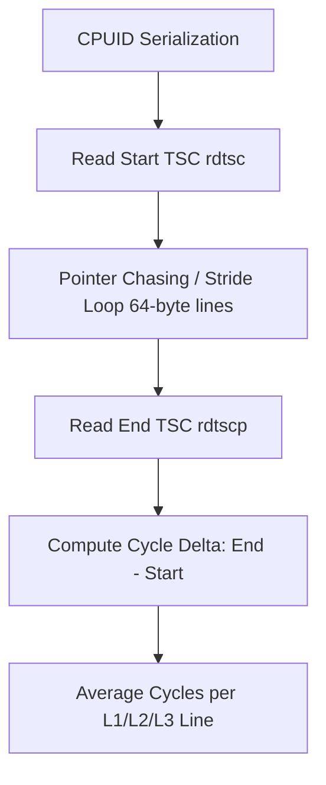

# 07 - Ultra-Low-Level Microarchitecture Profiler (x86-64 NASM)

## Executive Overview
A bare-metal hardware profiler written in **x86-64 Assembly (NASM syntax)**. It interfaces directly with CPU silicon using serializing instructions (`CPUID`, `RDTSCP`) to probe microarchitectural capabilities (AVX-512, AMX, cache line size), measure cycle latencies for L1/L2/L3 caches, and benchmark instruction pipeline throughput without OS abstraction layers.

## Microarchitectural Measurement Mechanics



### Source Tree
- **`src/hardware_profiler.asm`**: Pure x86-64 assembly implementing CPUID leaf queries, cache line stride traversal, and RDTSC latency measurement.
- **`src/main.c`**: C entrypoint driver linking with assembled object code.
- **`Makefile`**: Native compilation pipeline using NASM and GCC.
- **`runner/run.js`**: Simulated microarchitectural profiler validating cycle count ranges.

## Native Compilation & Execution
```bash
# Build with NASM and GCC
make
./hardware_profiler
```

## Universal Verification
```bash
node runner/run.js
node orchestrator/run.js --project=07-assembly
```

## Senior Interview Q&A
- **Q: Why use RDTSCP over RDTSC?** `RDTSC` is out-of-order and can execute before preceding memory loads complete. `RDTSCP` serializes instruction retirement, guaranteeing all prior memory reads have retired before reading the Time Stamp Counter.
- **Q: Why 64-byte stride for cache latency?** x86-64 cache lines are 64 bytes wide. Striding by exactly 64 bytes guarantees that each access hits a distinct cache line, defeating hardware prefetchers and measuring true access latency.\n